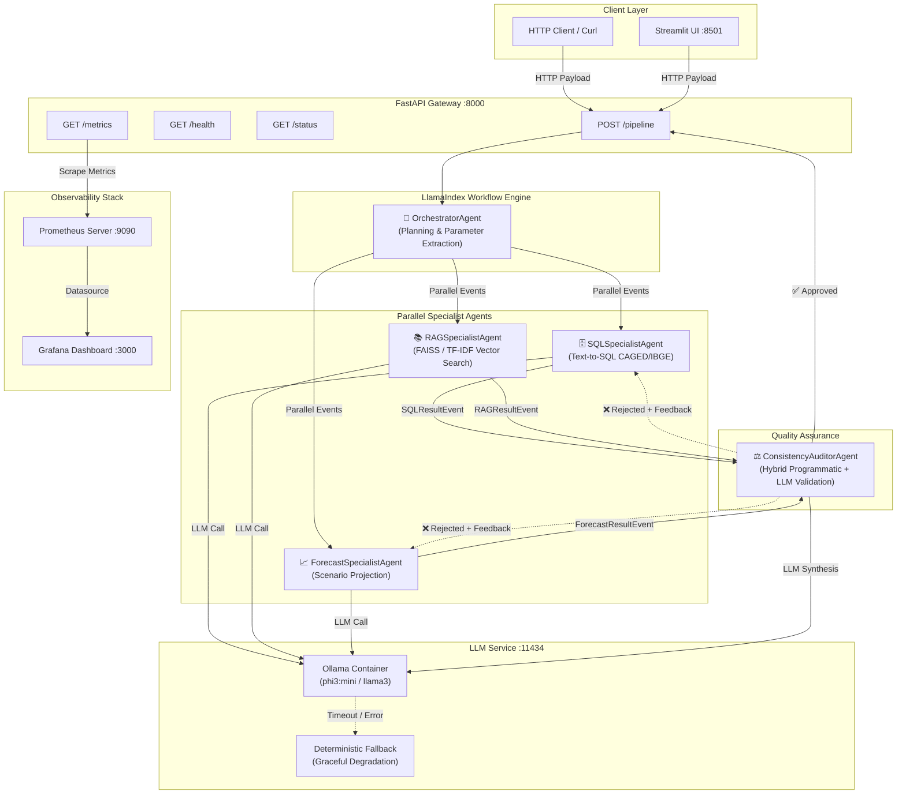

# 🏭 Industrial Intelligence Ecosystem

### Ecossistema Multi-Agente Industrial Production-Ready (Azure + Kubernetes + Docker)

<div align="center">

[](https://github.com/p-esteves/industrial-intelligence-ecosystem/actions/workflows/ci.yml)
[](https://python.org)
[](https://fastapi.tiangolo.com)
[-black.svg)](https://ollama.ai)
[](https://github.com/facebookresearch/faiss)
[](https://prometheus.io)
[](https://grafana.com)
[](https://docker.com)

</div>

---

## 📖 Visão Geral

O **Industrial Intelligence Ecosystem** é uma plataforma multi-agente containerizada para monitoramento, análise estatística e geração de inteligência sobre indicadores da indústria brasileira (como dados do CAGED/IBGE). 

Projetado para ambientes de alta disponibilidade compatíveis com **Azure AKS (Azure Kubernetes Service)**, **Docker Compose** e **Arquitetura de Microserviços**, o sistema executa um fluxo autônomo end-to-end de **6 agentes especializados** orquestrados via **LlamaIndex Workflows** (event-driven), com observabilidade completa via **Prometheus + Grafana** e suporte a **LLM 100% local via Ollama** com **Graceful Degradation**.

---

## ⚡ Quick Start (Execução em 1 Comando)

O sistema foi preparado para rodar do zero sem qualquer configuração manual:

```bash
# 1. Clonar o repositório
git clone https://github.com/p-esteves/industrial-intelligence-ecosystem.git
cd industrial-intelligence-ecosystem

# 2. Subir todos os serviços com um único comando
docker-compose up --build -d
```

### 🌐 Endpoints e Interfaces Disponíveis

| Serviço / Interface | URL Local | Descrição |
| :--- | :--- | :--- |
| **Documentação API (Swagger UI)** | [http://localhost:8000/docs](http://localhost:8000/docs) | Documentação interativa FastAPI |
| **Pipeline Trigger (POST)** | `http://localhost:8000/pipeline` | Dispara execução completa dos agentes |
| **Health Check (Kubernetes)** | `http://localhost:8000/health` | Health probe (liveness/readiness) |
| **Status dos Agentes (GET)** | `http://localhost:8000/status` | Estado operacional em tempo real |
| **Métricas Prometheus (GET)** | `http://localhost:8000/metrics` | Exporte de métricas operacionais |
| **Grafana Dashboard** | [http://localhost:3000](http://localhost:3000) | Dashboard pré-configurado (User: `admin` / Pass: `admin`) |
| **Prometheus Scraper** | [http://localhost:9090](http://localhost:9090) | Servidor de métricas Prometheus |
| **Interface Streamlit** | [http://localhost:8501](http://localhost:8501) | Painel interativo de inteligência |

---

## 🏗️ Arquitetura do Sistema Multi-Agente

O sistema utiliza **LlamaIndex Workflows** para orquestração event-driven de 6 agentes especializados com execução paralela, loop de auto-correção e auditoria híbrida (programática + semântica):



### 🔄 Fluxo de Auto-Correção (Self-Healing Loop)

O `ConsistencyAuditorAgent` executa **validação programática determinística** (checagem matemática, consistência de setores, detecção de contradições lógicas entre tendências) **antes** de usar o LLM para síntese final. Se alguma validação falhar, o workflow **retorna automaticamente** os eventos com feedback corretivo para os agentes especialistas (até 5 iterações), garantindo convergência e eliminação de alucinações.

---

## 👥 Agentes Especialistas e Responsabilidades

### 1. 🎯 OrchestratorAgent (`agents/orchestrator.py`)
- **Função**: Analisa a pergunta do economista em linguagem natural e extrai parâmetros estruturados (UF, Setor, Horizonte de Projeção) usando o LLM.
- **Saída**: Plano de execução com subtarefas e parâmetros extraídos, disparando eventos paralelos para os 3 agentes especialistas.

### 2. 🗄️ SQLSpecialistAgent (`agents/sql_specialist.py`)
- **Função**: Traduz a consulta do usuário em SQL válido (Text-to-SQL) e executa contra a base CAGED/IBGE, retornando registros históricos de admissões, desligamentos, saldo e salário médio.
- **Proteção**: Write-protection ativa (rejeita INSERT/UPDATE/DELETE/DROP).
- **Análise de Tendência**: Calcula programaticamente se a tendência dos dados é de crescimento, queda ou estabilidade.

### 3. 📚 RAGSpecialistAgent (`agents/rag_specialist.py` + `core/tools.py`)
- **Função**: Executa busca vetorial semântica sobre documentos industriais indexados (via **LlamaIndex VectorStoreIndex** ou fallback **TF-IDF + Cosine Similarity**) e extrai entidades estruturadas (fator macroeconômico dominante, impacto qualitativo).
- **Documentos Indexados**: Manuais, boletins e relatórios setoriais em `data/sample/docs/`.

### 4. 📈 ForecastSpecialistAgent (`agents/forecast_specialist.py`)
- **Função**: Gera projeções de massa salarial e empregados sob 3 cenários macroeconômicos (Pessimista, Base, Otimista) com variáveis de contorno (Selic, IPCA, câmbio, PIB, confiança industrial FGV).
- **Auto-Correção**: Se o `ConsistencyAuditorAgent` detectar contradição lógica (ex: histórico em queda mas projeção em crescimento), o Forecast ajusta dinamicamente os cenários aplicando decaimento proporcional.
- **Justificativa para Economistas**: Usa o LLM para gerar uma justificativa técnica do modelo econométrico utilizado (SARIMAX + XGBoost ensemble).

### 5. ⚖️ ConsistencyAuditorAgent (`agents/consistency_auditor.py`)
- **Função**: Motor de validação híbrido (programático + semântico) que atua como Chief Editor / Quality Assurance do sistema.
- **Validações Programáticas (Fase 1)**:
  - Checagem matemática: `admissões - desligamentos == saldo` em todos os registros.
  - Consistência de setor entre SQL e Forecast.
  - Detecção de contradição lógica entre tendência SQL, narrativa RAG e projeção Forecast.
- **Síntese Semântica (Fase 2)**: Se todas as validações passarem, o LLM compila o relatório final em Markdown estruturado com tabelas, cenários e recomendações.

### 6. 📥 IngestionAgent + AnalysisAgent (`agents/ingestion_agent.py` + `agents/analysis_agent.py`)
- **Ingestão**: Carrega, valida e converte dados tabulares industriais dos formatos **CSV**, **Parquet** e **SQLite**.
- **Análise Estatística**: Executa detecção de anomalias baseada em **Z-Score** ($Z = \frac{X - \mu}{\sigma}$) e **IQR** sobre massa salarial e saldo de empregos, classificando por severidade (`CRITICAL`, `HIGH`, `MEDIUM`).
- **Observabilidade**: Emite métricas Prometheus (`industrial_anomalies_detected_total`, `industrial_agent_execution_duration_seconds`).

---

## 🎯 Caso de Uso Industrial Concreto

O repositório acompanha um conjunto de dados industriais sintéticos simulando o **CAGED (Cadastro Geral de Empregados e Desempregados)** e indicadores do IBGE localizados na pasta `/data/sample/`:

- `data/sample/caged_industrial.csv`: Dados de movimentação de empregos formais e massa salarial.
- `data/sample/caged_industrial.parquet`: Versão em formato Parquet para alta performance de leitura.
- `data/sample/docs/manual_diretrizes_industriais.txt`: Manual de análise conjuntural industrial para consulta semântica via RAG.

### Anomalias Injetadas no Dataset Demonstrativo:
1. **Extrativa Mineral (Minas Gerais - 2024-09)**: Queda brusca de -43.2% na massa salarial devido a paralisações temporárias operacionais ($Z = -3.10$).
2. **Indústria de Transformação (São Paulo - 2024-11)**: Onda severa de desligamentos com saldo negativo de -8.500 postos ($Z = -2.85$).

---

## 📈 Métricas e Observabilidade

O ecossistema implementa observabilidade nativa no padrão **Prometheus**:

### Métricas Expostas (`GET /metrics`):
- `industrial_pipeline_executions_total{status="success|error"}`: Total de execuções do pipeline.
- `industrial_pipeline_duration_seconds`: Histograma de latência do pipeline completo.
- `industrial_anomalies_detected_total{sector, severity}`: Total de anomalias estatísticas identificadas.
- `industrial_agent_execution_duration_seconds{agent}`: Histograma de latência por agente individual.
- `industrial_llm_fallback_total{reason}`: Contador de acionamento do modo de degradação graciosa.
- `industrial_agent_status{agent}`: Gauge do estado operacional dos agentes.

### Dashboard Grafana Pré-Configurado
Ao subir o `docker-compose up`, o Grafana é autoprovisionado na porta `3000` com o datasource Prometheus e o dashboard **Industrial Multi-Agent Ecosystem** pré-instalado.

---

## 🛠️ Decisões Técnicas e Justificativas

| Tecnologia | Decisão Técnica & Rationale |
| :--- | :--- |
| **LlamaIndex Workflows** | Framework de orquestração event-driven que permite execução paralela de agentes, coleta de resultados e loops de auto-correção com tipagem forte (Pydantic Events). |
| **FastAPI** | Framework Python assíncrono de altíssimo desempenho, nativamente compatível com Pydantic v2 e documentação Swagger automática. |
| **Ollama** | Servidor de inferência LLM local e open-source. Permite rodar modelos como Phi-3 ou Llama 3 on-premises com zero custo e total privacidade de dados. |
| **FAISS + TF-IDF** | Busca vetorial densa (LlamaIndex VectorStoreIndex) com fallback para TF-IDF + Cosine Similarity via scikit-learn, garantindo retrieval funcional mesmo sem GPU. |
| **Prometheus + Grafana** | Padrão da indústria para monitoramento de microserviços e aplicações cloud-native em clusters Kubernetes. |
| **Docker Multi-Stage Build** | Garante imagens enxutas, separando a camada de compilação de dependências da imagem final de execução em produção (Python 3.11-slim). |
| **Tenacity (Retry Policy)** | Todas as chamadas LLM assíncronas usam retry exponencial (3 tentativas) para tolerância a falhas transitórias de rede ou serviço. |

---

## 🧪 Testes e CI/CD Pipeline

O repositório possui cobertura completa de testes unitários e de integração com `pytest`:

```bash
# Executar todos os testes
pytest -v

# Verificar linting e formatação
ruff check .
```

### GitHub Actions Workflow (`.github/workflows/ci.yml`)
Cada `git push` ou `pull_request` dispara automaticamente o workflow de CI/CD que executa:
1. Setup do ambiente Python 3.11.
2. Instalação e validação de dependências.
3. Linting de código com **Ruff**.
4. Execução da suíte completa de testes unitários e de integração (**pytest**).
5. Validação da construção da imagem Docker (**docker build** & `docker compose config`).

---

## 📄 Licença

Desenvolvido como projeto de demonstração avançada em Gen AI, Engenharia de Dados e Engenharia de Software Cloud-Native. Licença MIT.
